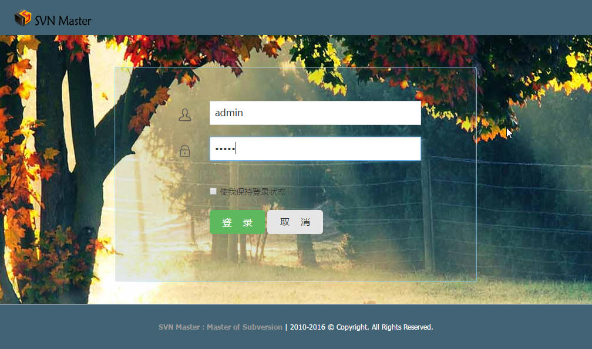
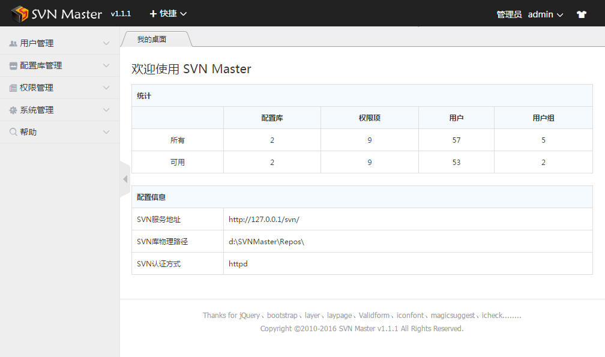
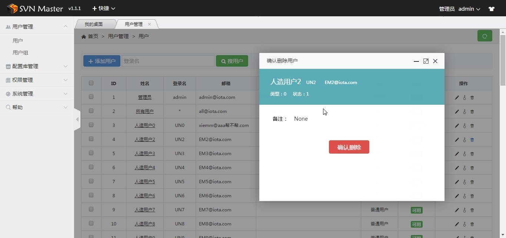
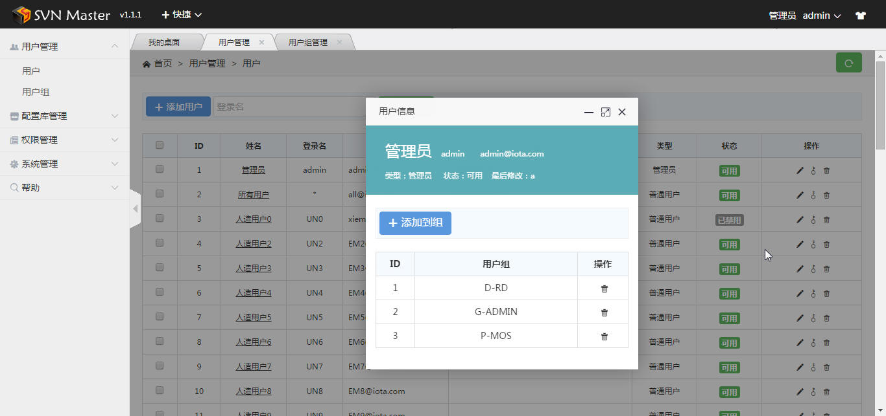
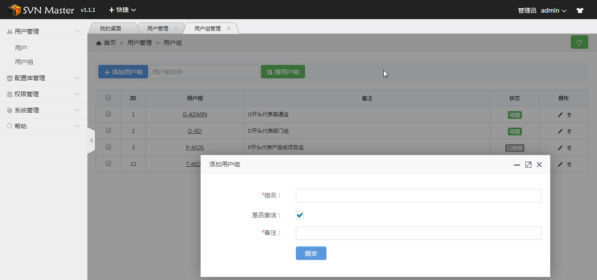
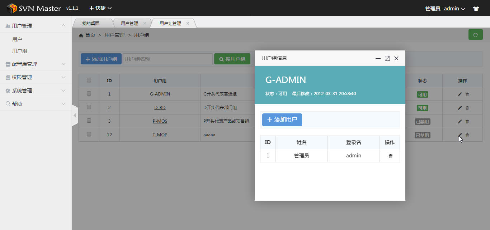
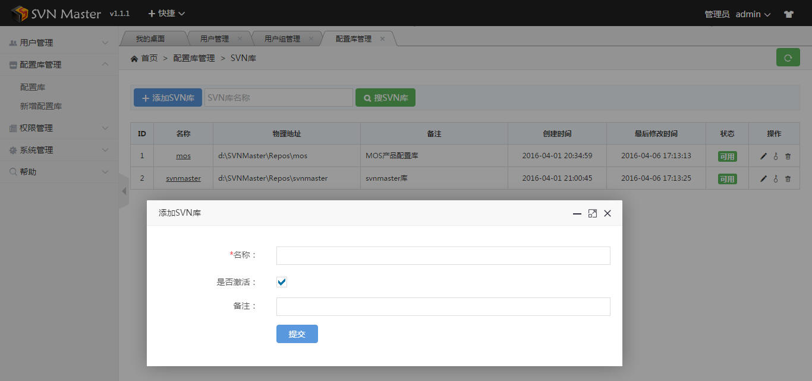
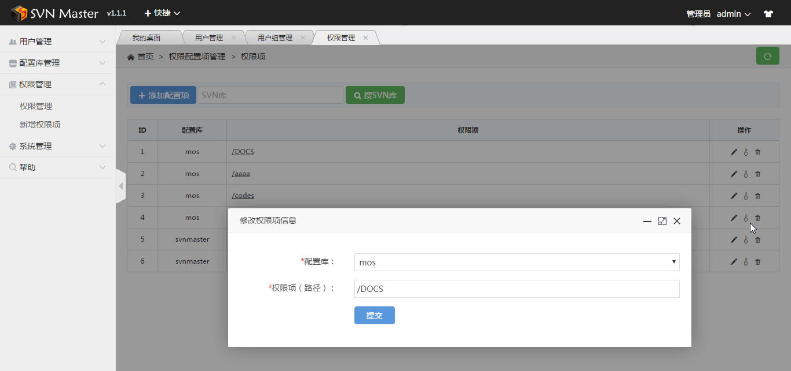
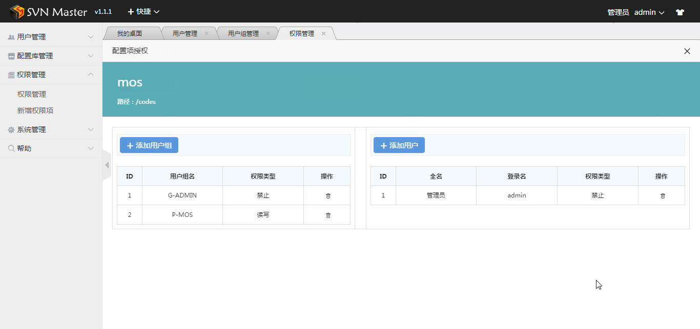
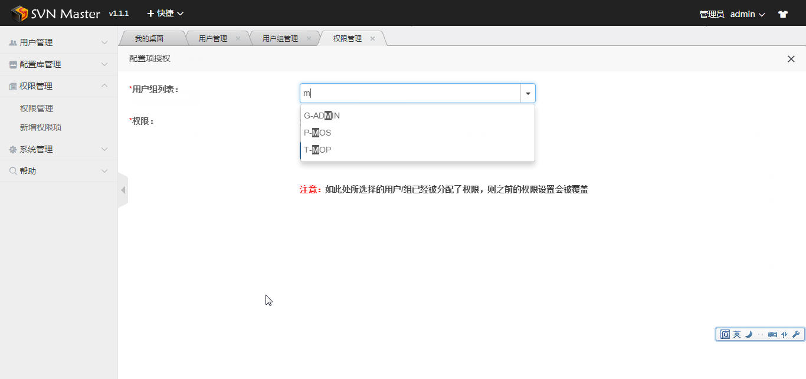

#如何使用SVN Master
***
##功能说明
SVN Master是使用Python编写的基于Web的SVN（Subversion）管理工具，主要功能包括：

* SVN用户管理：支持用户添加、删除、修改密码等
* SVN用户组管理：支持用户组的添加、删除、修改等
* SVN配置库管理：支持配置库的新增、删除、修改名称
* SVN权限管理：支持基于路径的用户权限和用户组权限设置
* Apache集成：除了传统的svnserver认证模式，也支持Apache集成SVN时的htpasswd认证模式

##使用之前
###依赖
SVN Master是使用Python编写的SVN（Subversion）管理工具，因此在使用前需安装以下软件：

- Python：3.4 ＋    以及基于Python的以下模块：

 + Flask：0.10.1 +

 + flask-sqlalchemy：2.1 +

 + Flask-WTF：0.12 +

 + Flask-Login：0.3.2 +

 + flask-OpenID：1.2.5 +

###依赖的安装方法
1.首先安装Python:

* Windows版本,在[这里](https://www.python.org/downloads/windows/)下载，默认选项安装即可
* Linux版本，在[这里](https://www.python.org/downloads/source/)下载源代码，安装方式如下：

	> xz -d Python-3.5.1.tar.xz
	> 
	> tar xf Python-3.5.1.tar -C /usr/local/src/
	> 
	> cd /usr/local/src/Python-3.5.1/
	> 
	> ./configure --prefix=/usr/local/python35
	> 
	> make -j8 && make install

2.将Python路径加入系统变量：

将Python的安装目录以及其Script文件夹加入系统变量：

	> C:\Python35\;
	> C:\Python35\Scripts\;

* Windows环境：
  + 系统属性 - 高级 - 环境变量 - 系统变量 - Path
* Linux环境：
	> 编辑'~/.bash_profile'文件，将
	> 
	>> PATH=$PATH:$HOME/bin
	
	> 改为：
	> 
	>>PATH=$PATH:$HOME/bin:/usr/local/python35/bin
	>
	>使 python3.4 环境变量生效：
	>
	>> . ~/.bash_profile
	
	3.安装Python相关的模块

* 打开Shell,依次执行以下命令：
	> 
	> pip install Flask
	> 
	> pip install flask-sqlalchemy
	> 
	> pip install Flask-WTF
	> 
	> pip install Flask-Login
	> 
	> pip install flask-OpenID

4.将[SVN Command服务](https://subversion.apache.org/packages.html)文件包的bin目录（如：C:\svn1.9.3\bin;）加入系统环境变量，方法同上

5.如果使用Apache集成SVN，需将Apache的bin目录（如：C:\Apache24\bin;）也加入系统环境变量，方法同上

6.验证以上配置的正确性，打开CMD或Shell，输入：
> python
> 
> htpasswd

如果没有出现错误信息，说明配置成功。

##开始使用
###部署
* 将本文件夹放置到任意目录即可
###基本配置
系统提供了几个基本配置项如下，在根目录下的 'config.py' 文件中：

	#本系统使用的端口号
	SERVER_PORT = 800
	
	#SVN配置库存放的根目录，以\\结尾
	REPOS_DIRS='d:\SVNMaster\Repos\\'
	#SVN的网络访问路径
	REPOS_BASE_URL='http://127.0.0.1/svn/'
	
	#SVN认证相关配置
	#支持httpd（即Apache集成方式）或svnserver
	SVN_AUTH_MODE = 'httpd' 
	#Apache集成方式下的权限（authz）和htpasswd（用户&密码）文件位置
	SVN_HTTPD_AUTHZ = 'd:\SVNMaster\Repos\\authz'
	SVN_HTTPD_USERS = 'd:\SVNMaster\Repos\\htpasswd'

###启动
打开CMD 或 Shell，切换到上述 'config.py' 文件所在文件夹中，输入：
> python server.py

然后打开127.0.0.1:800 （800为上一步设置的端口号）即可开始使用本系统

如果启动过程中出现错误，请检查 安装 及 配置工作是否正确。

##开始使用
###注意：
在本系统的操作，除配置库管理（新增、修改、删除）立即生效外，其它的如用户密码修改、权限授权等操作，应在操作完成后，点击 
> 页面左上角 快捷 菜单 中的 刷新权限 菜单

方可生效。

###登录
系统的初始用户/密码为：
> 用户名：admin
> 
>密码：admin

##功能
###建议的顺序
开始对SVN进行管理，建议顺序如下：
	
- 新建配置库
- 新建用户
- 新建用户组
- 将用户加入到用户组
- 新建权限项（包括 配置库 和 权限路径 的一条记录）
- 将权限项的权限授权给用户或用户组（建议尽可能使用 用户组 方式授权）
- 刷新权限

###图示
登录页面

欢迎信息页面

用户管理页面

用户信息页面

用户组管理页面

用户组信息页面

配置库管理页面

权限项管理页面

配置项授权页面

添加用户组授权页面

###It's very easy to use,isn't it?
###祝您使用愉快！
如需帮助，可邮件至[EIXXIE(eixxie@qq.com)](eixxie@qq.com).
